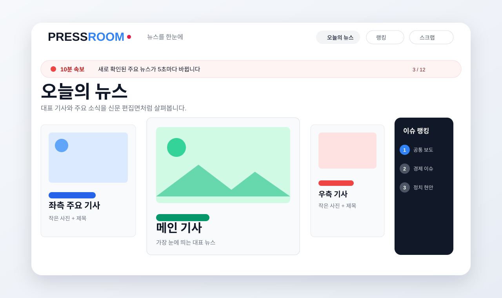
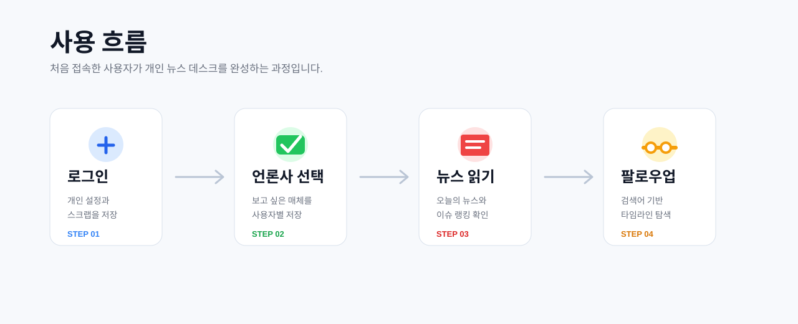
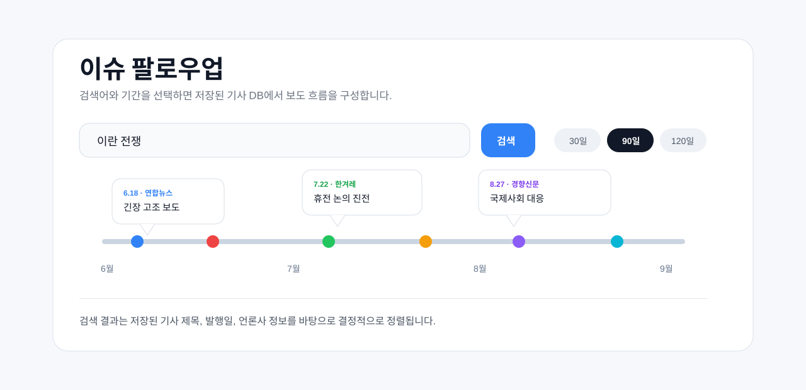
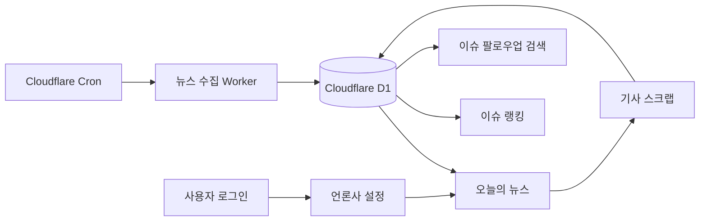

# PRESSROOM

국내 언론사의 온라인 1면, 사설·오피니언, 이슈 랭킹, 이슈 팔로우업을 한곳에서 보는 개인 뉴스 데스크입니다. 로그인한 사용자는 보고 싶은 언론사를 선택하고, 기사를 읽고, 다시 볼 기사를 스크랩할 수 있습니다.



## 주요 기능

- **개인화된 뉴스 데스크**: 로그인한 사용자별로 선택 언론사와 스크랩을 저장합니다.
- **온라인 1면 구성**: CNN형 신문 편집면처럼 큰 대표 기사와 작은 주요 기사를 함께 보여줍니다.
- **10분 속보 롤러**: 최근 10분 안에 새로 확인된 기사를 상단 티커에서 순환 표시합니다.
- **이슈 랭킹**: GPT 없이 제목 유사도와 공통 보도 언론사 수를 기준으로 오늘의 주요 이슈를 묶습니다.
- **이슈 팔로우업**: 저장된 기사 DB를 검색해 한 주제의 보도 흐름을 타임라인으로 보여줍니다.
- **내 홈페이지 기사 읽기**: 외부 링크로 바로 보내지 않고, PRESSROOM 안에서 기사 요약형 읽기 화면을 엽니다.
- **기사 스크랩**: 관심 기사를 내 스크랩 탭에 저장하고 다시 볼 수 있습니다.

## 사용 예시



1. **로그인하기**

   로그인해야 언론사 설정, 스크랩, 개인화된 데스크가 저장됩니다.

2. **언론사 선택하기**

   언론사 설정 탭에서 보고 싶은 언론사를 고릅니다. 아무 언론사도 선택하지 않으면 뉴스 영역은 비어 있습니다.

3. **오늘의 뉴스 보기**

   선택한 언론사의 온라인 1면 기사를 신문 편집면처럼 확인합니다. 같은 이슈를 여러 언론사가 다뤄도 화면에는 대표 기사 중심으로 정리됩니다.

4. **이슈 랭킹 확인하기**

   여러 언론사가 함께 다룬 주제를 순위로 봅니다. 순위는 조회수가 아니라 저장된 기사 제목의 유사도와 언론사 수를 기준으로 계산합니다.

5. **이슈 팔로우업 검색하기**

   검색어와 기간을 선택하면 저장된 기사 DB에서 관련 기사를 찾아 날짜별 타임라인으로 보여줍니다.

6. **스크랩하기**

   다시 읽고 싶은 기사는 북마크 버튼으로 저장합니다.

## 이슈 팔로우업



이슈 팔로우업은 웹을 매번 다시 검색하지 않습니다. Cloudflare D1에 누적된 기사 데이터를 먼저 검색하고, Elasticsearch 연결 정보가 있으면 Elasticsearch를 우선 사용합니다. 그래서 같은 검색어에 대해 더 일관된 결과를 얻을 수 있습니다.

타임라인의 점은 기사 한 건을 뜻합니다. 점 위에 보이는 말풍선에는 날짜, 언론사, 기사 제목이 표시되어 한 이슈가 어떤 순서로 보도됐는지 빠르게 볼 수 있습니다.

## 지원 언론사

현재 13개 언론사를 지원합니다.

| 구분 | 언론사 |
| --- | --- |
| 종합지 | 동아일보, 조선일보, 한겨레, 경향신문, 서울신문, 세계일보, 중앙일보, 한국일보, 국민일보, 문화일보 |
| 경제지 | 한국경제, 매일경제 |
| 통신사 | 연합뉴스 |

언론사 페이지 구조가 바뀌면 수집 결과가 달라질 수 있습니다. 수집 상태는 앱 안의 언론사 수집 상태 영역에서 확인할 수 있습니다.

## 동작 방식



- 기사 수집은 10분 간격 Cron Worker와 사용자의 새로고침으로 실행합니다.
- `articles` 테이블은 기사 원본 저장소입니다.
- `articles_fts`는 D1 FTS5 기반 제목 검색에 사용합니다.
- `scraps`는 사용자별 저장 기사를 관리합니다.
- `settings`는 사용자별 선택 언론사와 설정값을 저장합니다.
- `sources`는 언론사·섹션별 수집 상태를 저장합니다.

## GPT 사용 여부

현재 핵심 뉴스 분류와 검색 흐름은 GPT 없이 동작하도록 구성되어 있습니다.

| 기능 | GPT 사용 | 기준 |
| --- | --- | --- |
| 오늘의 뉴스 정렬 | 사용 안 함 | 저장된 기사 제목의 핵심어와 유사도 |
| 이슈 랭킹 | 사용 안 함 | 공통 보도 언론사 수와 최신성 |
| 이슈 팔로우업 | 사용 안 함 | D1 FTS5 또는 Elasticsearch 검색 |
| 기사 수집 | 사용 안 함 | 언론사 페이지/RSS 메타데이터 |

## 로컬 실행

Node.js 22.13 이상이 필요합니다.

```sh
npm ci
npm run db:local
npm run dev
```

개발 서버는 기본적으로 `http://localhost:5173`에서 실행됩니다. 로컬 개발에서는 `/signin-with-chatgpt?return_to=/`로 테스트 로그인을 사용할 수 있습니다.

## 검증

```sh
npm run typecheck
npm run lint
npm run check:news
npm run check:api
npm run build
```

`check:api`는 실행 중인 로컬 서버와 테스트 계정을 사용합니다. 테스트 중 생성한 스크랩은 정리하고 기존 스크랩은 보존합니다.

## Cloudflare 배포

이 프로젝트는 Cloudflare Workers와 D1을 사용합니다.

```sh
npm run build
npm run deploy:cloudflare
npm run deploy:collector
```

D1 마이그레이션은 다음 명령으로 적용합니다.

```sh
npm run db:cloudflare
```

Elasticsearch를 연결하려면 사이트 Worker와 수집 Worker에 다음 secret을 설정합니다.

```sh
ELASTICSEARCH_URL
ELASTICSEARCH_API_KEY
ELASTICSEARCH_INDEX
```

`ELASTICSEARCH_INDEX`를 생략하면 기본값은 `pressroom-articles`입니다. Elasticsearch가 없어도 D1 FTS5 검색은 계속 작동합니다.

## 참고

- 자세한 구현 메모와 운영 제한은 [PROJECT.md](PROJECT.md)에 정리되어 있습니다.
- 온라인 1면은 각 언론사 홈페이지의 주요 기사 링크를 뜻합니다. 종이신문 PDF나 기사 전문 복제본을 제공하지 않습니다.
- 기사 원문 저작권과 언론사 이용 조건을 준수해야 합니다.
